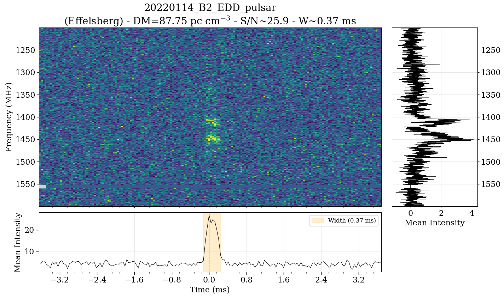

# FRB plotter 💥📡📉
---
## Overview

This repository contains three standalone plotting scripts:

| Format                      | Script            |
| --------------------------- | ----------------- |
| HDF5 (`.h5`)                | `plot_frb_h5.py`  |
| SIGPROC filterbank (`.fil`) | `plot_frb_fil.py` |
| NumPy array (`.npy`)        | `plot_frb_npy.py` |

All scripts support:

* Optional dedispersion
* Time/frequency downsampling
* Automatic pulse windowing (`--cut`)
* Manual frequency flagging (`--flag-freq`)
* Symmetric time axis (`-s`)
* Saving figures to PNG

## Files
- plot_frb_h5.py
- plot_frb_fil.py
- plot_frb_npy.py
- LICENSE
- requirements.txt
- README.md

## Installation
pip install -r requirements.txt

## Usage

### (1) Plotting `.h5` Files

Expected datasets:

* `/data`
* `/index_map/freqs`
* `/index_map/times`

Optional:

* `/flag`
* `/good_freq`
* metadata stored in attributes

#### Basic usage

```bash
python plot_frb_h5.py burst.h5
```

#### Example with options

```bash
python plot_frb_h5.py burst.h5 \
  --cut 50 \
  -f 4 -t 4 \
  --flag-freq "1540-1560,1200-1220" \
  -s \
  --window-size 10 \
  --save-png
```

---

### (2) Plotting `.fil` Files (SIGPROC Filterbank)

Reads filterbank files using `sigpyproc`.

If a DM is present in the header, it will be used automatically.
You can override with `--dm`, or disable dedispersion using `--no-dedisperse`.

#### Basic usage

```bash
python plot_frb_fil.py observation.fil
```

#### Example with explicit DM

```bash
python plot_frb_fil.py observation.fil \
  --dm 412.4 \
  --cut 50 \
  -f 4 -t 2 \
  --flag-freq "1540-1560" \
  --save-png
```

#### Disable dedispersion

```bash
python plot_frb_fil.py observation.fil --no-dedisperse
```

---

### (3) Plotting `.npy` Files

Assumes array shape:

```
(time, frequency)
```

Frequency axis is constructed from `--fmin` and `--fmax`.
Time axis is computed from `--tsamp`.

`--dm` is required unless `--no-dedisperse` is used.

#### Basic usage

```bash
python plot_frb_npy.py dynspec.npy --dm 412.4
```

#### Full example

```bash
python plot_frb_npy.py dynspec.npy \
  --dm 412.4 \
  --fmin 1000 --fmax 1500 \
  --tsamp 9.8304e-5 \
  --cut 50 \
  --flag-freq "1540-1560" \
  -f 4 -t 2 \
  -s \
  --save-png \
  -o dynspec.png
```

#### Disable dedispersion

```bash
python plot_frb_npy.py dynspec.npy --no-dedisperse
```

---

### Common Options

| Option                        | Description                                                             |
| ----------------------------- | ----------------------------------------------------------------------- |
| `-h`, `--help`                | Show help message and exit                                              |
| `-f N`, `--freq-downsample N` | Frequency downsampling factor                                           |
| `-t N`, `--time-downsample N` | Time downsampling factor                                                |
| `--cut N`                     | Auto-find the pulse and extract a window of `±N` ms around it           |
| `--dm DM`                     | Dispersion measure for dedispersion in pc cm⁻³                          |
| `--no-dedisperse`             | Skip dedispersion even if a DM is available                             |
| `--flag-freq "f1-f2,f3-f4"`   | Manually mask one or more frequency ranges in MHz                       |
| `-s`, `--sym`                 | Use a symmetric time axis centered on the pulse (`t=0` at pulse center) |
| `--window-size N`             | Set time window size as a multiple of pulse width; default is `10`      |
| `--save-png`                  | Save the plot as a PNG file                                             |
| `--save-fil`                  | Save the processed data as a new `.fil` file                            |
| `--save-npy`                  | Save the processed data as a new `.npy` file                            |
| `--save-h5`                  | Save the processed data as a new `.h5` file                            |

---
## Example plot

```bash
python plot_fil.py 20220114_B33_cDD_DM87.7527_F2048_b32_d1.fil --flag-freq 1550-1559 --dm 87.75 --sym --window-size 10 -f 32
```

